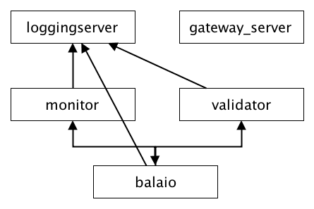

Design
======

balaio
------

Orquestra a execução dos módulos :mod:`monitor` e :mod:`validator` e gerencia a configuração
do sistema de maneira que esses módulos utilizem as mesmas diretivas.

monitor
-------

Monitora eventos no sistema de arquivos em busca de pacotes SPS e rSPS que deverão
ser incorporados, em 1 ou N coleções, e é dividido em:

* monitor:
    Monitora eventos no sistema de arquivos por meio da lib *inotify* (linux),
    produz uma instância de :class:`models.Attempt` representando a tentativa
    de ingresso de um pacote no sistema, e encaminha essa instância para o
    módulo :mod:`validator`, onde será realizada sua validação.

* checkin
    Inspeciona o conteúdo do pacote em busca de extrair sua identidade.
    A identidade de um pacote é composta pelo seu *checksum*, e metadados
    do artigo presentes no arquivo *xml* que deve estar presente.

validator
---------

Submete a instância de :class:`models.Attempt` a um *pipeline* de validação, onde
cada *pipe* (segmento do *pipeline*) é responsável pela validação de um aspecto
do pacote.

loggingserver
-------------

Recebe e consolida os *logs* dos módulos :mod:`monitor`, :mod:`validator` e :mod:`balaio`.

httpd
--------------

Disponibiliza uma interface HTTP para acesso e manipulação dos dados.

uploader
--------

Abstrai os backends de persistência de arquivos estáticos, por meio da 
superclasse :class:`uploader.BlobBackend`.

Classes concretas de :class:`uploader.BlobBackend` devem implementar os 
métodos *connect(self)* e *cleanup(self)*. Ambos os métodos não devem 
receber argumentos, que devem ser passados na inicialização da instância
quando necessário.

:class:`uploader.StaticScieloBackend`
~~~~~~~~~~~~~~~~~~~~~~~~~~~~~~~~~~~~~

Classe concreta para a persistência de arquivos no servidores de ativos estáticos
do SciELO. A comunicação é realizada via protocolo SFTP, e depende das credenciais
de um usuário apto a realizar a ação.

Exemplo::

    >>> from uploader import StaticScieloBackend
    >>> with StaticScieloBackend(u'some.user', u'some.pass', u'/base/path/') as backend:
    ...     backend.send(open(u'article.pdf', 'rb'), u'/abc/article.pdf')
    ...
    u'http://static.scielo.org/abc/article.pdf'

.. note::

    É importante que diferentes aplicações, que manipulam *base paths* distintos, 
    possuam usuários com as devidas restrições de acesso, para evitar perda de 
    dados acidental.

